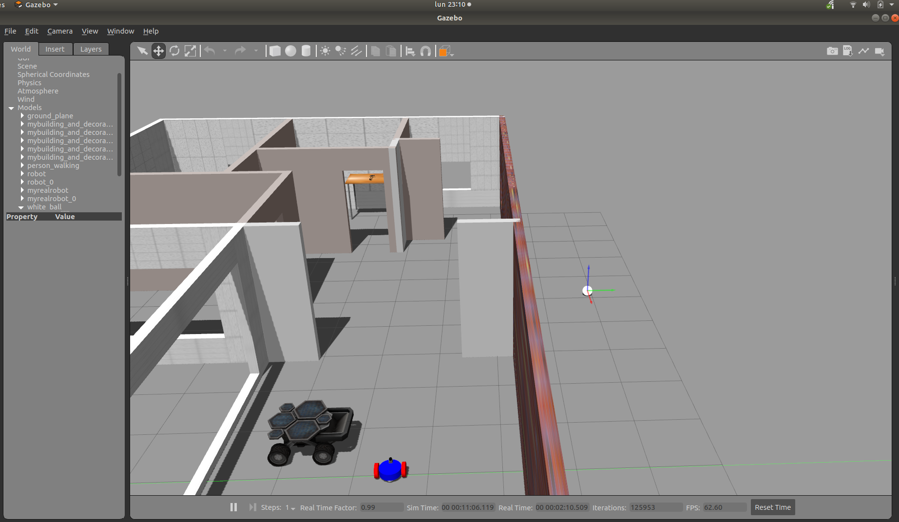
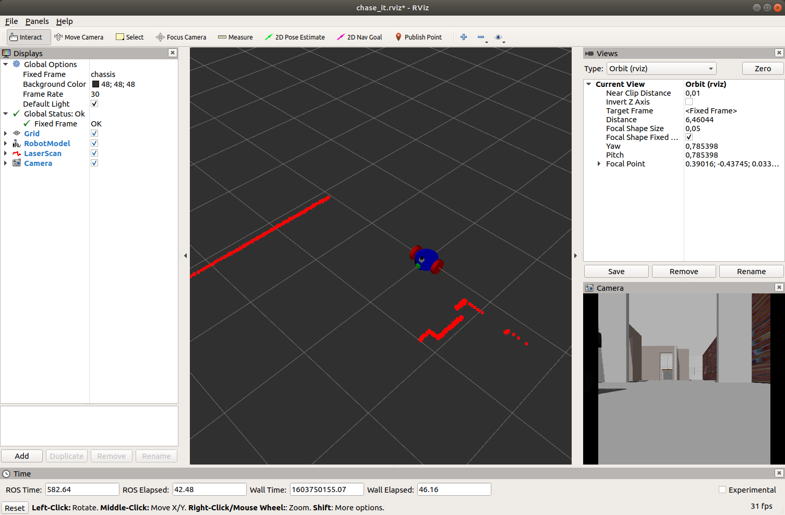

# Chase_it
Chase_it is basic robot simulation that can be used as a base project to start your own modified version.

It is basically composed by two different components:
- The simulation of the robot that holds a world and a very simple robot inside.
- A ROS package that enables the robot to detect and follow a ball in the world.

# Installation
This simulation have been tested and created in:
- [Ubuntu 18.04](https://ubuntu.com/download/desktop) (supports Ubuntu 16.04 or superior) 
- [ROS Melodic](http://wiki.ros.org/melodic/Installation/Ubuntu) (supports ROS kinetic or superior)
- [Gazebo 9.0](http://gazebosim.org/tutorials?cat=install&tut=install_ubuntu&ver=9.0) (supports Gazebo 7.0 or superior)

### Create a catkin workspace to compile and run the simulation

```bash
mkdir -p catkin_ws/src # create 2 folders
cd catkin_ws # go to main folder
catkin_make # create some folders and files
cd src
git clone git@github.com:daniel-lopez-puig/chase_it.git #clone this repository
cd .. # go back to catkin_ws
catkin_make
```

### Run the simulation
This will open two windows, gazebo and rviz.
In gazebo you can see all the simulated world with the robot, a building and a white ball.



On the other hand you will have a rviz window thats shows what the robot sees using the laser and the front camera.



```bash
cd catkin_ws
source devel/setup.bash
roslaunch my_robot daniel.world

```
### Run the ROS package
Now to run the ROS package that runs the logic, open a second terminal, and run the following commands

```bash
cd catkin_ws
source devel/setup.bash
roslaunch ball_chaser ball_chaser.launch
```

### Let the robot see the ball
Move the ball in a place that the camera can detect it and see how the robot chase it!


# Structure


# Thanks

# License

